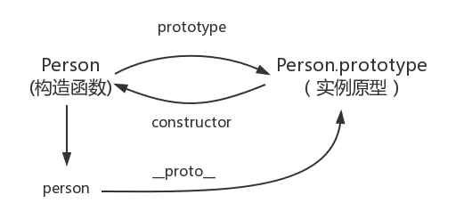

### 原型链

- 每个实例对象(object)都有`__proto__`私有属性,该属性指向其原型对象(实例原型)(prototype),在调用实例的方法和属性时,如果在实例对象上找不到,就会往原型对象上找(实例的`__proto__`等于构造函数的`prototype`属性)
- 构造函数的`prototype`属性也指向实例的原型对象
- 原型对象的`constructor`属性指向构造函数
- 一句话描述:JavaScript对象通过prototype指向父类对象,直到指向Object为止,这样就形成了一个原型指向的链条.

```
// Person 构造函数
function Person() {

}

// person 实例对象
var person = new Person()

构造函数的prototype指向实例的原型
person.__proto__ = Person.prototype

实例原型的constructor指向构造函数
Person.__proto__.constructor = Person


```

### 继承
1. 借助构造函数继承
```
function Person(name) {
    this.name = name
}

function Child() {
    Person.call(this)
    this.type = child
}
// 如果父级原型对象中存在方法,那么子类无法继承
```
2. 原型链继承
```
// 由于原型链继承共享属性实例属性的缺点，属于引用类型传值，
// 缺点1：引用副本实例属性的修改必然会引起其他副本实例属性的修改，所以不常使用(改变其中一个实例,其他的实例也会修改)
// 缺点2：不能向父类构造函数随时传递参数，很不灵活
1. 先创建父类实例（方法）
function SuperType() {
    this.property = true;
}
function SubType() {
    this.subproperty = true;
}

2. 改变实例原先的proto转而连接到子类的prototype
SubType.prototype = new SuperType()

```
3. 组合式继承
```
// 常用原型链继承+构造函数继承
// 原型链继承共享属性(属性和方法)，构造函数继承父类构造函数的实例属性
// 缺点：调用了两次父类构造函数，生成了两份实例，一个子类实例，一个父类实例，父类实例作为prototype使用
function Person(name, age) {
    this.name = name
    this.age = age
    this.action = ['speak', 'run', 'eat']
}
Person.prototype.say = function() {
    console.log(`${this.name}${this.age}`)
}
function Student(name, age, score) {
    Person.call(this, name, age) // 借用构造函数，第一次调用父类构造函数
    this.score = score
}

Student.prototype = new Person() // 原型链继承，第二次调用父类构造函数
```
4. 寄生式继承(组合式继承优化)
```
// 缺点：原型链继承多个实例的引用类型属性指向相同，存在篡改的可能。无法传递参数
function Parent4 () {
 this.name = 'parent4';
 this.play = [1, 2, 3];
}
function Child4() {
 Parent4.call(this);
 this.type = 'child4';
}
Child4.prototype = Parent4.prototype;
```
5. 寄生组合式继承
```
function Parent5 () {
 this.name = 'parent5';
 this.play = [1, 2, 3];
}
function Child5() {
 Parent5.call(this);
 this.type = 'child5';
}
// 解决了两次调用父类构造函数问题,并且修改原型不会影响其他子类的原型
Child5.prototype = Object.create(Parent5.prototype);
Child5.prototype.constructor = Child5;
```

## ES5和ES6继承
1. ES5使用借助构造函数实现继承;ES6使用子类的__proto__等于父类,子类原型的__proto__等于父类的原型

```
```
function extend(Child, Parent) {
    var F = function(){}
    F.prototype = Parent.prototype
    Child.prototype = new F()
    Child.prototype.constructor = Child
}
var person = {
    name: "Nicholas",
    friends: ["Shelby", "Court", "Van"]
};

var anotherPerson = extend(person);
```
```