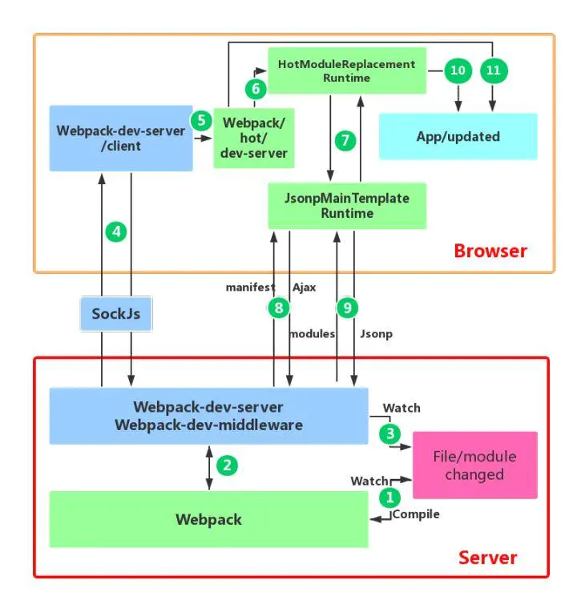

1. webpack对文件系统进行watch打包到内存中

webpack-dev-middleware 调用 webpack 的 api 对文件系统 watch，当文件发生改变后，webpack 重新对文件进行编译打包，然后保存到内存中。

webpack 将 bundle.js 文件打包到了内存中，不生成文件的原因就在于访问内存中的代码比访问文件系统中的文件更快，而且也减少了代码写入文件的开销。

2. devServer通知浏览器端文件发生改变

在启动devServer的时候，sockjs在服务端和浏览器端建立了一个webSocket长连接，以便将webpack编译和打包的各个阶段状态告知浏览器，**最关键的步骤还是webpack-dev-server调用webpack api监听compile的done事件，当compile完成后，webpack-dev-server通过_sendStatus方法将编译打包后的新模块hash值发送到浏览器端**

3. webpack-dev-server/client接收到服务端消息做出响应

webpack-dev-server/client当接收到type为hash值暂存起来，当接收到type为ok的消息后对应用执行reload操作。

4. webpack接收到最新hash值验证并请求模块代码

通过jsonp请求最新的模块代码，然后将代码返回给HMR runtime，HMR runtime会根据返回的新模块代码进一步处理。返回最新hash值对应代码块，进行模块热更新。

5. HotModuleReplacement.runtime对模块进行热更新

这一步是整个模块热更新（HMR），而且模块热更新都是发生在HMR runtime中的hotApply方法中。模块热更新的错误处理，如果在热更新过程中出现错误，热更新将回退到刷新浏览器。