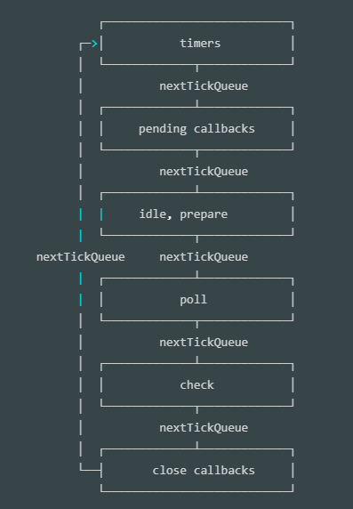

## 是什么
执行非阻塞I/O操作

## 六个循环阶段
1. **timers**阶段：这个阶段执行`setTimeout(callback)`和`setInterval(callback)`预定的callback
2. **I/O callbacks**阶段：此阶段执行某些系统操作的回调，例如TCP错误的类型、如果TCP套接字在尝试连接时收到ECONNREFUSED，则某些*nix系统希望等待报告错误。这些操作将等待在==I/O回调阶段==执行。
3. **idle，prepare**阶段：仅node内部使用
4. **poll**阶段：获取新的I/O事件，例如操作读取文件等等，适当的条件下node将阻塞在这里。
5. **check**阶段：执行`setImmediate()`设定的callbacks
6. **close callbacks**阶段：比如`socket.on('close', callback)`的callback会在这个阶段执行

## 各阶段详解
- timers：技术上来说，poll阶段控制timers什么时候执行
- 轮询poll阶段
    - 计算应该阻塞并I/O轮询的时间
    - 处理轮询队列中的事件

当事件循环进入轮询（poll）阶段并且没有任何计时器调度时，将发生以下两种情况之一：
- 如果轮询队列不为空，则事件循环将遍历其回调队列，使其同步执行，直到队列用尽或达到与系统相关的硬限制为止
- 如果轮询队列为空，则会发生以下两种情况之一
    - 如果已通过setImmediate调度了脚本，则事件循环将结束轮询poll阶段，并继续执行check阶段以执行那些调度的脚本
    - 如果脚本并没有setImmediate设置回调，则事件循环将等待poll队列中都回调，然后立即执行它们

一旦轮询队列poll为空，事件循环将检查哪些计时器timer已经到时间。如果一个或多个计时器timer准备就绪，则事件循环将返回到计时器阶段，以执行这些计时器的回调。

- 检查阶段check：此阶段允许在轮询poll阶段完成后立即执行回调。如果轮询poll阶段处于空闲，并且脚本已使用setImmediate进入check队列，则事件循环可能会进入check阶段，而不是在poll阶段等待。
- close callbacks阶段：如果套接字或句柄突然关闭（例如socket.destroy），则在此阶段将发出‘close’事件。否则它将通过process.nextTick发出。

## setTimeout vs setImmediate
- setTimeout计划在以毫秒为单位的最小阈值过去之后运行脚本
- setImmediate设计在当前轮询poll阶段完成后执行脚本

如果两者调用在一个I/O回调中，那么setImmediate总是执行第一；否则不确定。

- 为什么在外部（比如主代码部分）这两者的执行顺序不确定

在mainline部分执行setTimeout设置定时器（没有写入队列），与setImmediate写入check队列。mainline执行完开始事件循环，第一阶段是timers，这时候timers队列可能为空，也可能有回调；如果没有那么执行chekc队列的回调，下一轮循环在检查并执行timers队列的回调，如果有就先执行timers的回调，再执行check阶段的回调。

## process.nextTick
在每个阶段完成之后立即执行

- 为什么使用process.nextTick
    1. 在事件循环继续之前下个阶段允许开发者处理错误，清理所有不必要的资源，或者重新尝试请求
    2. 有时需要让回调在事件循环继续下个阶段之前运行

