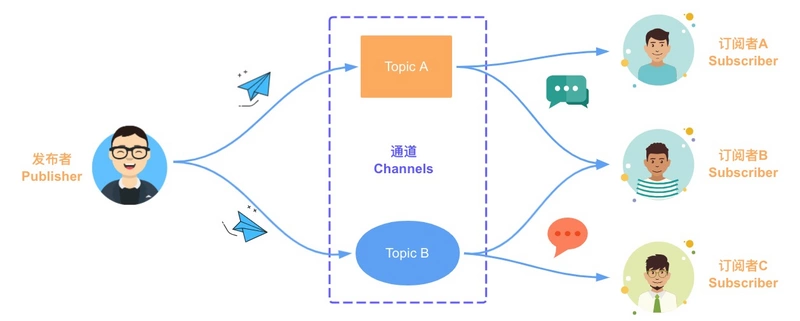

## 观察者模式

### 是什么
定义了一种一对多的关系，让多个观察者对象同时监听某一个主题对象（被观察者），这个主题对象（被观察者）的状态发生变化时就会通知所有的观察者对象，使得它们能够自动更新自己。

### 示例代码
```
interface Observer {
  notify: Function;
}

class ConcreteObserver implements Observer{
  constructor(private name: string) {}

  notify() {
    console.log(`${this.name} has been notified.`);
  }
}

class Subject { 
  private observers: Observer[] = [];

  public addObserver(observer: Observer): void {
    console.log(observer, "is pushed!");
    this.observers.push(observer);
  }

  public deleteObserver(observer: Observer): void {
    console.log("remove", observer);
    const n: number = this.observers.indexOf(observer);
    n != -1 && this.observers.splice(n, 1);
  }

  public notifyObservers(): void {
    console.log("notify all the observers", this.observers);
    this.observers.forEach(observer => observer.notify());
  }
}
```

### 使用示例
```
const subject: Subject = new Subject();
const xiaoQin = new ConcreteObserver("小秦");
const xiaoWang = new ConcreteObserver("小王");
subject.addObserver(xiaoQin);
subject.addObserver(xiaoWang);
subject.notifyObservers();

subject.deleteObserver(xiaoQin);
subject.notifyObservers();
```

### 使用场景
- 一个对象的行为依赖于另一个对象的状态。或者换一种说法，当被观察者的状态发生改变时，会直接影响到观察对象的行为。类似于computed

## 发布订阅模式

### 是什么
在软件架构中，发布/订阅是一种消息范式，消息的发送者（发布者）不会将消息直接发送给特定的接收者（称为订阅者）。而是将发布的消息分为不同的类别，然后分别发送给不同的订阅者。同样的，订阅者可以表达对一个或多个类别的兴趣，只接收感兴趣的消息，无需了解哪些发布者存在。



### 示例代码
```
type EventHandler = (...args: any[]) => any;

class EventEmitter {
  private c = new Map<string, EventHandler[]>();

  // 订阅指定的主题
  subscribe(topic: string, ...handlers: EventHandler[]) {
    let topics = this.c.get(topic);
    if (!topics) {
      this.c.set(topic, topics = []);
    }
    topics.push(...handlers);
  }

  // 取消订阅指定的主题
  unsubscribe(topic: string, handler?: EventHandler): boolean {
    if (!handler) {
      return this.c.delete(topic);
    }

    const topics = this.c.get(topic);
    if (!topics) {
      return false;
    }
    
    const index = topics.indexOf(handler);

    if (index < 0) {
      return false;
    }
    topics.splice(index, 1);
    if (topics.length === 0) {
      this.c.delete(topic);
    }
    return true;
  }

  // 为指定的主题发布消息
  publish(topic: string, ...args: any[]): any[] | null {
    const topics = this.c.get(topic);
    if (!topics) {
      return null;
    }
    return topics.map(handler => {
      try {
        return handler(...args);
      } catch (e) {
        console.error(e);
        return null;
      }
    });
  }
}
```

### 使用示例
```
const eventEmitter = new EventEmitter();
eventEmitter.subscribe("ts", (msg) => console.log(`收到订阅的消息：${msg}`) );

eventEmitter.publish("ts", "TypeScript发布订阅模式");
eventEmitter.unsubscribe("ts");
eventEmitter.publish("ts", "TypeScript发布订阅模式");
```

### 应用场景
- 对象间存在一对多关系，一个对象的状态发生改变会影响其他对象。
- 作为事件总线，来实现不同组件间或模块间的通信。


## 两者的异同
1. 观察者模式松耦合,被观察者改变会直接影响观察者;订阅者和发布者无关系,通过中介完成
2. 观察者模式无法区别观察者的类别,就是被观察者变化,会影响所有的观察者;而订阅者会有类型区分,发布的时候会区别发给哪些订阅者.
3. 订阅发布模式=观察者模式 + 中介

